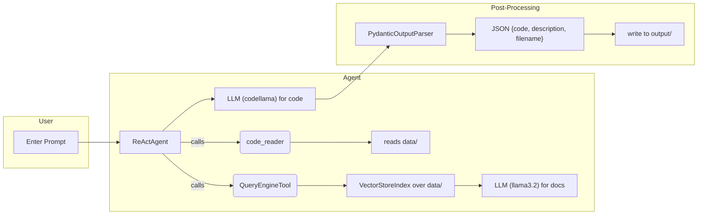

# Agent Code Generator

This project sets up a ReAct‑style agent that can:
- Read user prompts
- Use a vector index over your `data/` folder (including PDFs) via `QueryEngineTool`
- Read raw code files from `data/` via `code_reader`
- Generate new code with a dedicated LLM (`codellama`)
- Parse the LLM’s output into JSON (with code, description, filename)
- Save the generated code into `output/`

## Architecture



## Setup

```bash
# create and activate a venv
python3 -m venv .venv
source .venv/bin/activate    # on Windows use: .venv\Scripts\activate

# install dependencies
pip install -r requirements.txt
```

## Usage

1. Populate `data/` with code files or PDFs.
2. Ensure your `.env` has `LLAMA_CLOUD_API_KEY`.
3. Run `python main.py`, enter prompts when prompted.
4. Generated code appears in `output/` with the returned filename.
